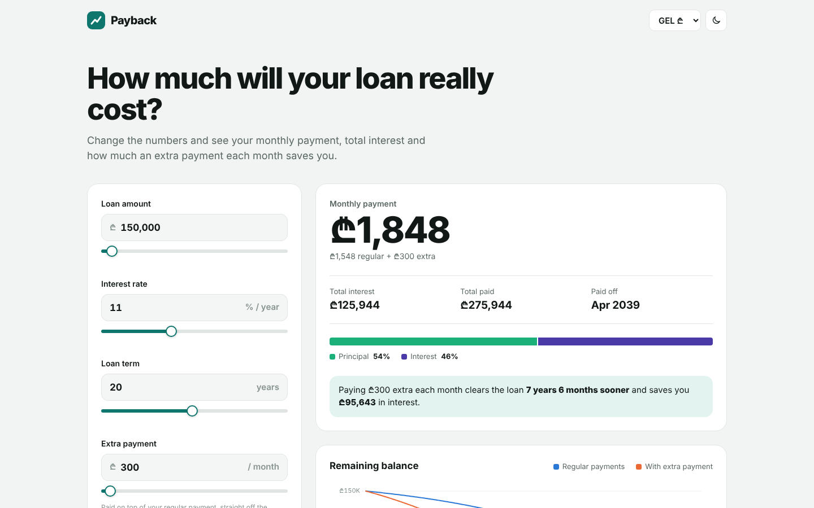
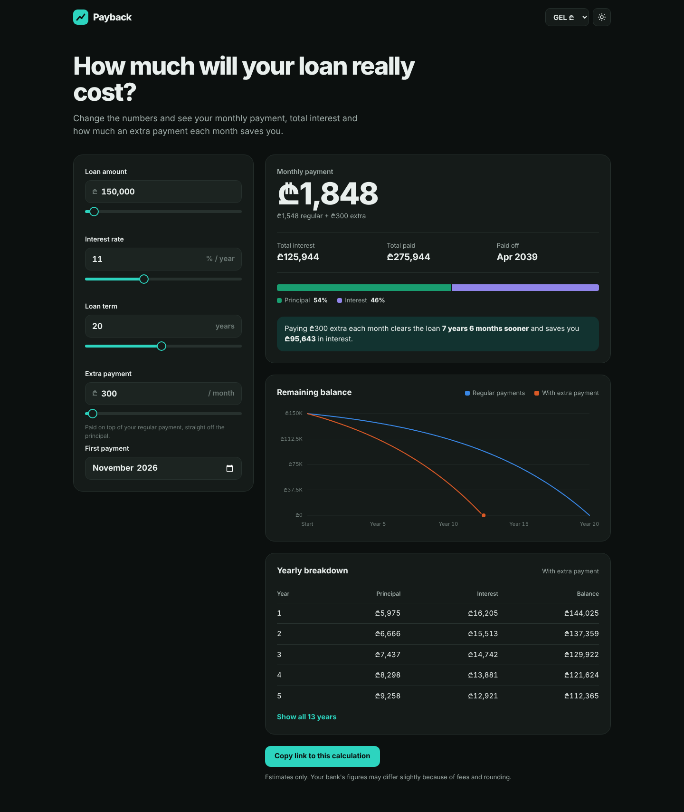
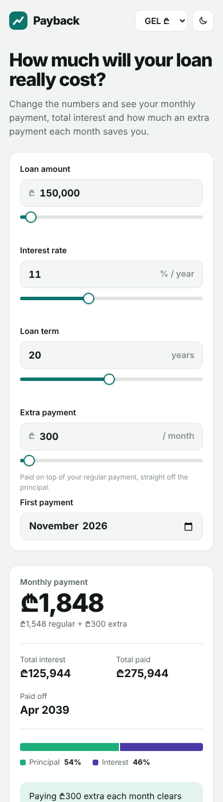

# Payback

A loan and mortgage calculator built with React and TypeScript.

**Live demo:** _add your Vercel link here_



## Features

- **Monthly payment, total interest, total paid and payoff date**, updated as you type or drag the sliders.
- **Extra payments.** See how much sooner the loan is paid off and how much interest you save.
- **Remaining balance chart** comparing regular and extra payments, with a hover and keyboard crosshair (arrow keys, Shift for whole years).
- **Principal vs. interest split** and a **yearly breakdown** table.
- **GEL, USD and EUR**, formatted with `Intl.NumberFormat`.
- **Shareable link.** Every input is kept in the URL, so a calculation can be bookmarked or sent.
- **Input validation** with clear messages for out-of-range values.
- **Light and dark themes**, responsive down to mobile.

| Dark mode | Mobile |
| --- | --- |
|  |  |

## How it calculates

Standard amortization: `payment = P · r / (1 − (1 + r)^−n)`, with `r` the monthly rate and `n` the number of months. The schedule is built month by month; extra payments go straight to the principal. Logic lives in `src/loan.ts`.

## Tech stack

React 19 · TypeScript · Vite · hand-built SVG chart · plain CSS.

## Run locally

```bash
npm install
npm run dev
```

## Embedding

It's a static site, so it can be embedded on any website with an `<iframe>`, or the components can be dropped into an existing React app.
